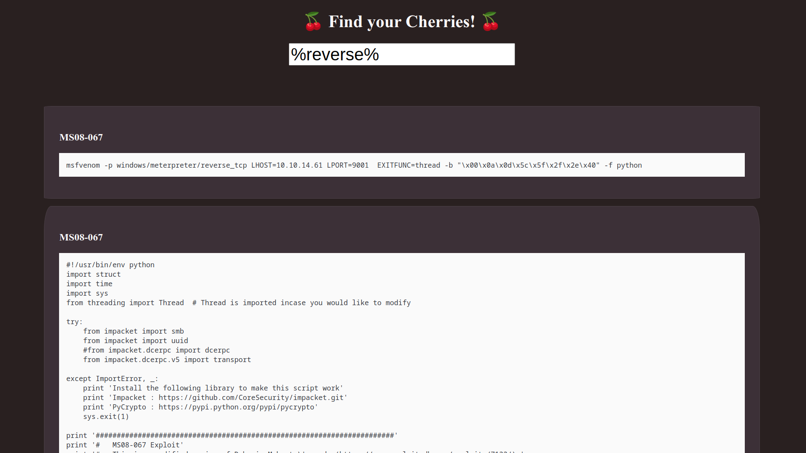

# CherryPicker

A tool for searching CherryTree sqlite database for code in codeboxes.

Supported CherryTree databases:

- SQLite unencrypted

## Usage

```bash
python -m venv venv
pip install -r requirements.txt
export PYTHONPATH=.
python cherry_picker -h
```

## Client (CLI)

TDB.

### Single-run

Run one-off commands and get results

```bash
python cherry_picker client node "%snippet%"
python cherry_picker client code "%bash -i%"
```

### Iteractive (Not Implemented)

Interact with the client in a command-loop.

## Server (Flask)

For now the flask site only queries the codebox contents.

Run the flask server with the following commands

```bash
# With flask
export FLASK_APP=cherry_picker/server
flask run

# Or an easier way with this
python run.py
```

This is how the front page looks, the search results appear on keyup events


